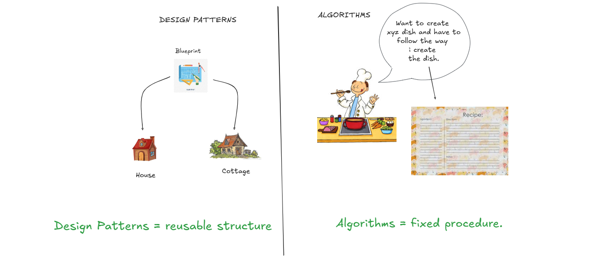
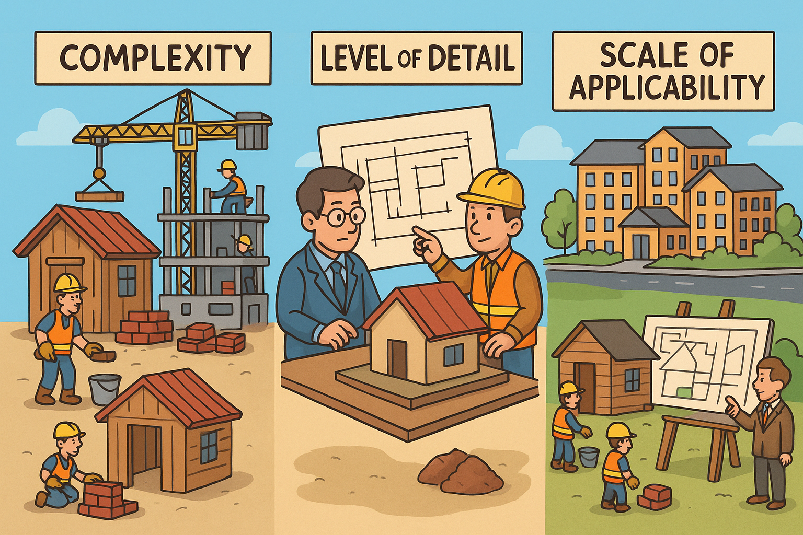

# DESIGN PATTERN IN C++

### WHAT ARE DESIGN PATTERNS?

- In the era of the OOP paradigm, developers have encountered common problems that occur in most projects. These problems were solved using generalized approaches. Some individuals observed, collected, analyzed these solutions, and created reusable templates—these are called **design patterns**.

### DIFFERENCE BETWEEN DESIGN PATTERNS AND ALGORITHMS

- Design patterns provide a high-level way to deal with commonly occurring problems. They suggest **how** to handle the issue but don't focus on the actual implementation.  
- Algorithms, on the other hand, are low-level, concrete solutions for specific problems, with a well-defined set of instructions to follow.  
- In short, **design patterns are like blueprints**, while **algorithms are defined step-by-step instructions**.

### WHY LEARN DESIGN PATTERNS?

- You will eventually start using these patterns—either knowingly or unknowingly—as you gain experience. It's better to learn them early so you're well-prepared to solve OOP-related issues efficiently.

### HOW ARE PATTERNS CLASSIFIED?

Design patterns can be classified based on three factors:
1. **Complexity**  
2. **Level of Detail**  
3. **Scale of Applicability**

> **Complexity** refers to the number of working parts involved in a pattern. For example, code with many modules and function calls is considered more complex than code with fewer components.

> **Level of Detail** defines the design depth of the pattern. It includes both low-level (code structure) and high-level (module interaction) perspectives.

> **Scale of Applicability** describes the scope of the pattern—some apply to small code structures, while others influence the entire system architecture.

> **NOTE:** The most basic and low-level patterns are called **idioms**, while more general and high-level ones are known as **architectural patterns**.

### GROUPS OF PATTERNS

Design patterns are broadly categorized into three main groups:

1. **Creational Patterns**  
   - These provide object creation mechanisms that increase flexibility and promote reuse of existing code.

2. **Structural Patterns**  
   - These deal with how classes and objects are composed to form larger structures while maintaining efficiency and flexibility.

3. **Behavioral Patterns**  
   - These focus on effective communication between objects and the assignment of responsibilities.
